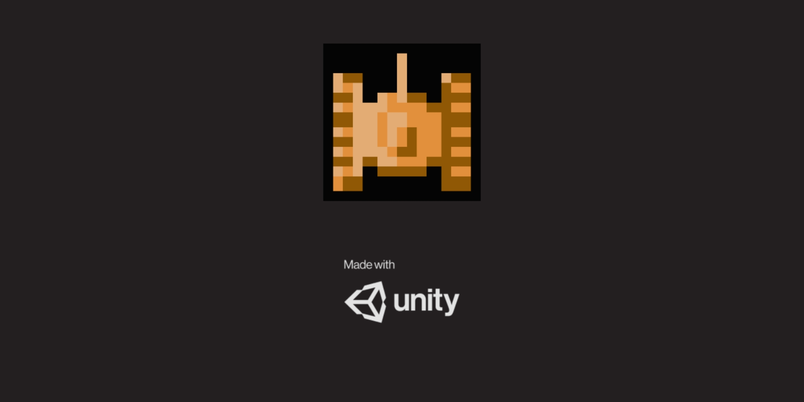
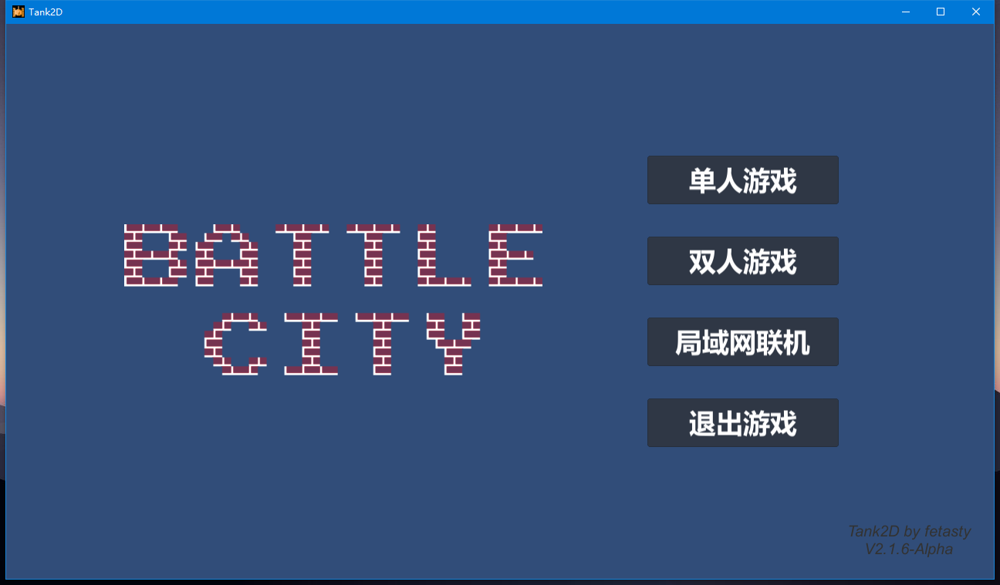
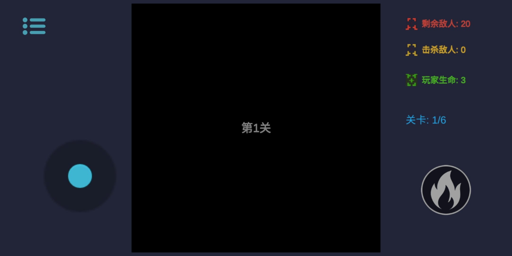
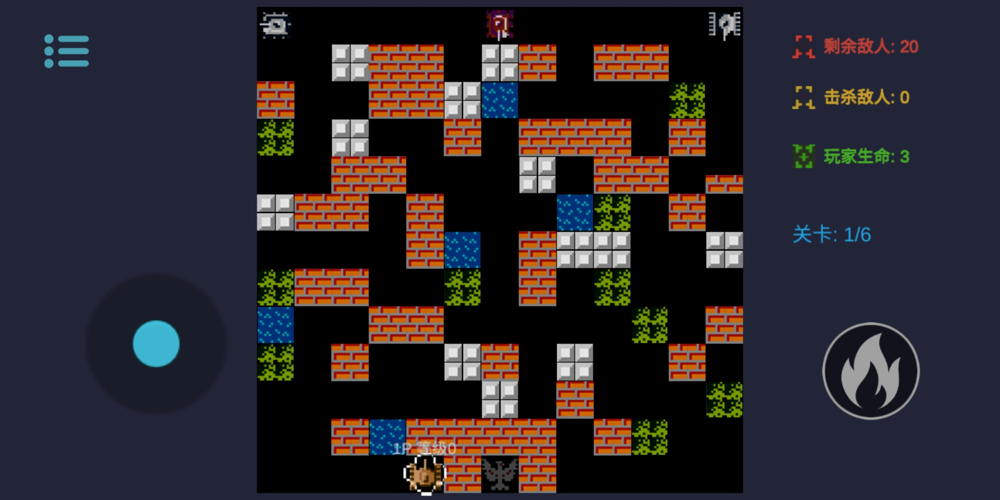
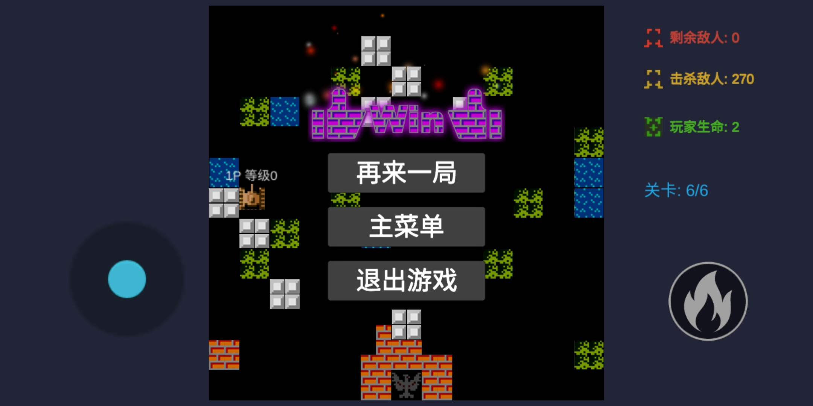

# 90Tank2D

[TOC]

经典的坦克大战游戏

-----

## 简介

初学游戏开发, 自己摸索着开发的小游戏, 弄了好长时间, 如果有不好的地方请轻喷, 也欢迎大佬们指正!

玩过红白机/插卡游戏机的朋友们, 还记得这个经典的小游戏吗?

本着学习的态度还原的90版的Tank, 加入了一点点自己的想法, 有兴趣的朋友赶紧试试吧!

编译了Android端和PC端, PC端可以支持本地双人游戏, iOS端因为没有mac就不折腾了, 如果有大佬帮忙编译那感激不尽!

**注意**
* 只有PC端有本地双人游戏选项
* PC端联机失败尝试关闭防火墙重试!

## 开发环境

* Win 10
* Unity 2019.3.7f1 / Unity 2019.3.8f1
* 依赖包:
  * Mirror 11.4.2

## 游戏截图

